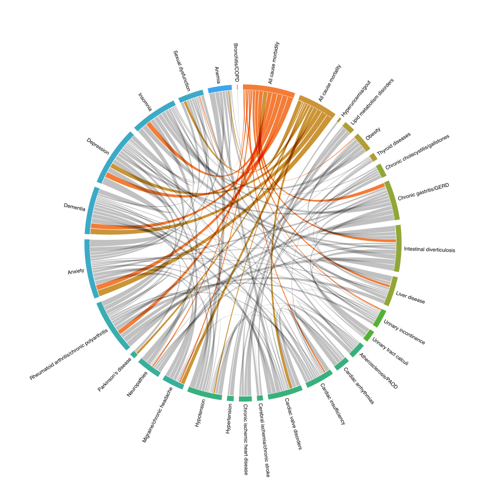

## Deep learning predicts onset acceleration of 38 age-associated diseases from blood and body composition biomarkers in the UK Biobank

This repository contains the code for the experiments in the onset acceleration paper, where we use machine learning to predict onset speed of age-associated diseases and analyse disease-disease/disease-biomarker relationships.

```
@article{ji2025deep,
  title={Deep learning predicts onset acceleration of 38 age-associated diseases from blood and body composition biomarkers in the UK Biobank},
  author={Ji, Mica Xu and Thanaj, Marjola and Nehale-Ezzine, L{\'e}na and Whitcher, Brandon and Thomas, E Louise and Bell, Jimmy D},
  journal={GeroScience},
  pages={1--68},
  year={2025},
  publisher={Springer}
}
```

### Simple usage

The loss functions for training a neural Cox PH model are defined in `nn_metrics.py`. Specifically `neg_cox_log_likelihood` defines the loss function and `compute_c_index` defines the evaluation metric.

These functions can be used to optimize and evaluate any PyTorch model. 

### Code structure

The main directory contains model training files, where `train_nn.py` is the high-level executable for training neural networks. 

UK Biobank data preparation files begin with `make_`. Researchers require their own access to the raw data.

Post-hoc analysis and plots are rendered by scripts in the `analyse` directory. 


